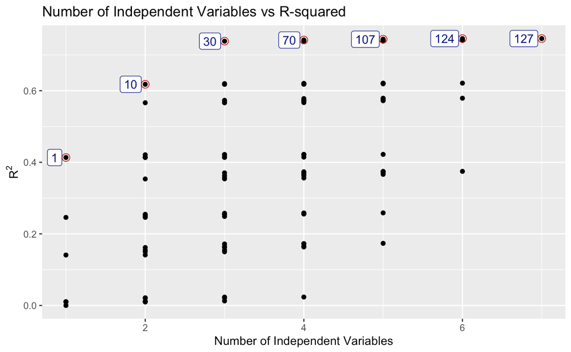

## Portfolio

---

### Data Projects 

[Best Subsets Model Selection](https://github.com/smithjph/College-Debt---Model-Selection)

---
[Model Selector (Iris Dataset)](https://github.com/smithjph/Model-Selector)

---
[NHL Team Performance](https://github.com/smithjph/NHL-Team-Performance)

---

### Other Projects

- [Project Euler](https://github.com/smithjph/Project-Euler)
- [Predicting Wine Scores](https://github.com/smithjph/Kaggle-Wine-Reviews)
- [Determining Reading Difficulty via Flesch-Kincaid](https://github.com/smithjph/Flesch-Kincaid-Reading-Ease-for-Texts)

---

### [My Resume](https://github.com/smithjph/smithjph.github.io/blob/master/pdf/Joel%20Smith%20Resume.pdf)

---

Page template forked from <a href="https://github.com/evanca/quick-portfolio">evanca</a>

<!-- Remove above link if you don't want to attibute -->
